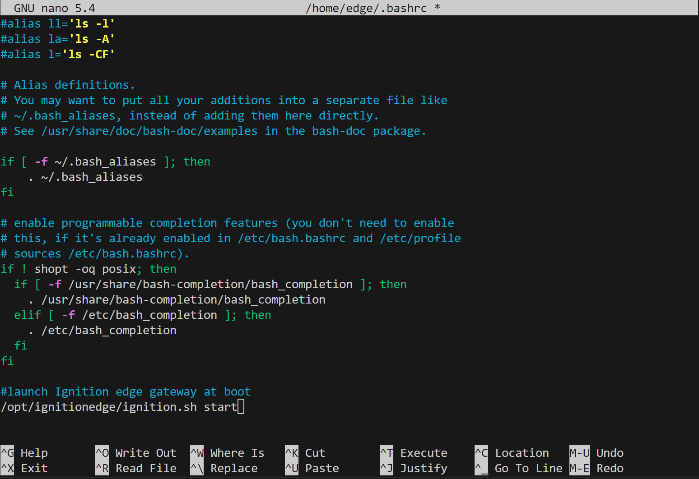

#  reTerminal DM Getting Started with Ignition Edge

<p style={{textAlign: 'center'}}></p>

<div class="get_one_now_container" style={{textAlign: 'center'}}>
    <a class="get_one_now_item" href="https://www.seeedstudio.com/reTerminal-DM-p-5616.html">
            <strong><span><font color={'FFFFFF'} size={"4"}> Get One Now 🖱️</font></span></strong>
    </a>
</div>

<br />

> Node-RED is a programming tool for wiring together hardware devices, APIs and online services in new and interesting ways.
> It provides a browser-based editor that makes it easy to wire together flows using the wide range of nodes in the palette that can be deployed to its runtime in a single-click.
>
> — nodered.org

Since reTerminal DM is equipped with rich scalability and hybrid connectivity, such as Digital I/O, CAN bus, RS485, RS232 and powerful wireless communication capabilities such as WiFi, BLE, \*4G, \*LoRa®. Where Node-RED is one of the best low-code programming tool which could rule them all, and Thanks to the Node-RED Dashboard node which could be configured and utilised together with the 10.1" 10-point multi-touch high-sensitivity capacitive panel for the on-site Human Machine Interface purpose.

> \*4G and LoRa® modules does not come with reTerminal DM by default, please purchase the relevant modules accordingly.

Here is the getting started guide on how to setup, as well as getting familiar with the Node-RED interface together on reTerminal DM.

:::tip
* For **Raspbian OS** User Please Go TO: [Install Node-RED](#install-and-setting-up-node-red)
* For **Sensecraft Edge OS** User Please Go TO: [Getting Familiar with Node-RED](#getting-familiar-with-node-red), Since Sensecraft Edge OS comes with Node-RED preinstalled
:::

## Hardware Prerequisite
- reTerminal DM x 1
- PC / Mac with SSH terminal capability
- PC / Mac with available hard drive capacity to install Ignition's Designer applciation.
- 12-24V DC power supply
- Ethernet cable

*This guide assumes your reTerminal DM is running a fresh install of Raspberry Pi OS(x64) with SSH terminal access from another client device. See [instructions to flash the ReTerminal DM operating system](https://wiki.seeedstudio.com/reterminal-dm-flash-OS/#steps-for-flashing-raspbian-os) if you require detailed instructions on this procedure.*

## Installing Ignition Edge On ReTerminal

To install Ignition Edge on your device is simple.

1. Visit [Ignition's Download Page](https://inductiveautomation.com/downloads/)
2. Download the version of the application you wish to use - you will be prompted to enter your information before you can download the package
3. Copy the compressed package to your edge device, where you wish it to be installed (I have chosen a location under /opt/)
4. Extract the package at the current location
5. Delete the leftover original package
6. Modify permissions to execute the Ignition start script
7. Launch the Igntion start script

A convenience script has been written that follows these steps and does not require you to create a user login for Inductive Automation's site. To use it, you simply need to get the ignition edge download/install script. Once you've downloaded the script, mark it as executable and run it. You will need superuser credentials in order to create the necessary directories. Go ahead and grab a coffee, this will take a few minutes to install.

```bash
curl -o download-ignition-edge.sh https://raw.githubusercontent.com/tulsasoftware/reterminal-ignition-edge-panel/main/download-ignition-edge.sh
sudo chmod +x ./download-ignition-edge.sh
sudo ./download-ignition-edge.sh
```

### Uninstalling

If you wish to uninstall the package (as installed by the installer script), simply download and execute the uninstall script. Inductive Automation does not suggest a default location for their application, so *this will only work for this custom installation*.

```bash
curl -o uninstall-ignition-edge.sh https://raw.githubusercontent.com/tulsasoftware/reterminal-ignition-edge-panel/main/uninstall-ignition-edge.sh
sudo chmod +x ./uninstall-ignition-edge.sh
sudo ./uninstall-ignition-edge.sh
```

## Launching Ignition Edge Gateway

When the installation is complete you will need to start the service. You can [setup the gateway to start on boot](#configuring-ignition-edge-to-launch-on-boot) and perform a reboot of the ReTerminal or you can choose to start the service manually.

 ```bash
sudo /opt/ignitionedge/ignition.sh start
```

You can easily check if the service is running if you are able to load the Ignition Edge license agreement page. Launch a web browser either on the ReTerminal itself at `localhost:8088` OR from another device on the network at `{reterminalhostname}:8088` OR from anywhere on the network with IP address of the ReTerminal itself at `{reterminalip}:8088`.


### Configuring Ignition Edge To Launch On Boot
It is recommended to launch the gateway's service automatically on boot of the device. There are multiple ways this can be accomplished and it is ultimately up to the user to decide how to do this.

As an example, you could add the launch command to your `.bashrc`. To do this, simply open your `.bashrc` in a text editor of your choice.
```bash
sudo nano ~/.bashrc
```
Append the launch command to the the file
```bash
/opt/ignitionedge/ignition.sh start'
```

And don't forget to save the file! 
(`ctrl + x` in the example above using nano)

This method does not launch the gateway on save, so reboot the ReTerminal to ensure the script works as expected.

## Configuring Ignition Edge

Configuring the gateway is a straight forward process. Proceed by accepting the EULA and then create a default user / password for Ignition. Remember this information as it will be created with admin credentials and be used for system configuration throughout this series.


After you have a user, you will be asked if you would like to change any of the default port configurations for the installation. I do not have a network with any conflicting ports, so I have chosen to accept the defaults. These ports will be used to communicate back to the primary SCADA installation, so if you are configuring to work with an existing installation Ignition, ensure that this page matches your expected values. Note that these are the core ports used for the application, but if you choose to install modules in the future you will likely have more ports to configure later.


You are now ready to initialize and launch the service! This takes a couple minutes to setup and does not require any interaction so you are free to check back later. It will redirect to the designer home page when it is complete and you are free to begin work!

